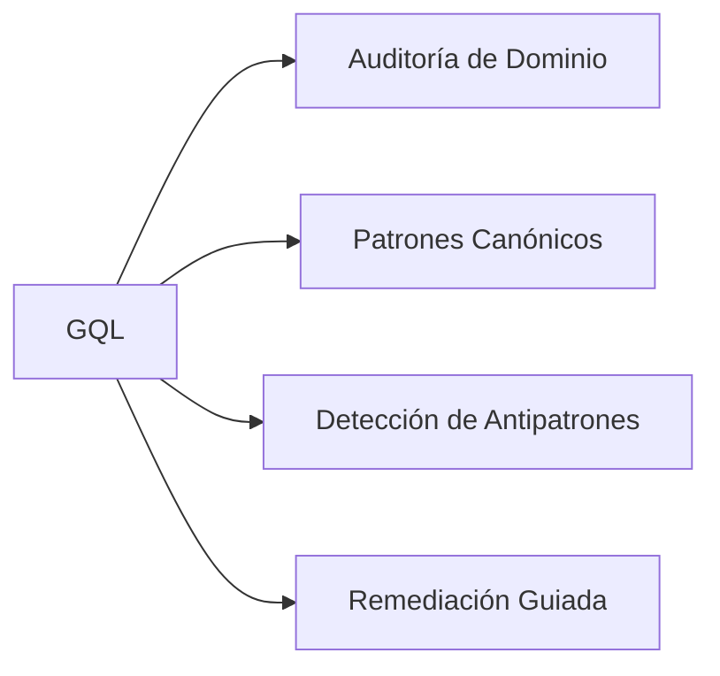

# Backend Graphql Skill Matrix

## Capacidades

## Protocolo de Auditoría (`$gql:audit`)

1. Detectar archivos del dominio en el proyecto
2. Evaluar cumplimiento de patrones canónicos
3. Identificar antipatrones y deuda técnica
4. Reporte por severidad (Alta / Media / Baja)
5. Remediación con `$gql:fix`
