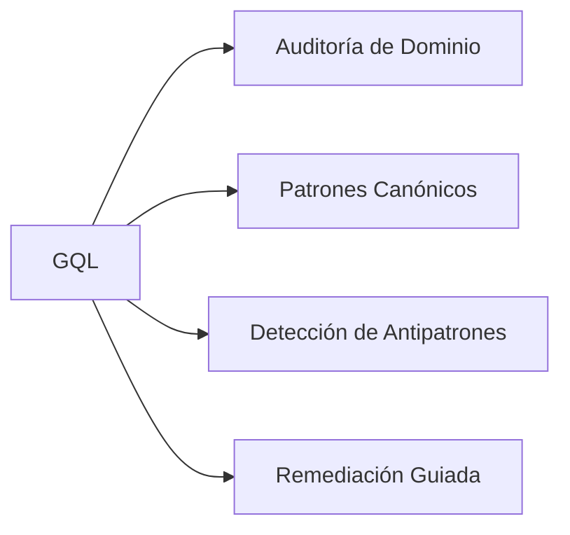

# Backend Graphql Skill Matrix

## Capacidades



## Protocolo de Auditoría (`$gql:audit`)

1. Detectar archivos del dominio en el proyecto
2. Evaluar cumplimiento de patrones canónicos
3. Identificar antipatrones y deuda técnica
4. Reporte por severidad (Alta / Media / Baja)
5. Remediación con `$gql:fix`


---

## 📝 Persistencia y Salida Activa (`overview/work/skill/`)

Al ejecutar esta skill (mediante `$gql` o `$gql:audit`), es **obligatorio crear o actualizar su reporte activo** dentro del proyecto cliente en la ruta:

`overview/work/skill/backend-graphql.md`

### Estructura Requerida del Reporte:

```markdown
# 📋 Registro Activo de Tareas — Backend GraphQL Agent Skill

> **Generado por**: `backend-graphql-agent-skill` (`$gql:audit`)  
> **Última actualización**: YYYY-MM-DD  

## 🎯 Tareas Pendientes Accionables

| ID | Tipo | Estado | Resumen | Evidencia/Ruta | Acción Requerida |
|---|---|---|---|---|---|
| GQL-01 | Fix / Refactor | Pendiente | <Resumen breve> | `<ruta:línea>` | <Remediación recomendada> |

## 📝 Observaciones y Detalles de Revisión
- Detalle técnico, evidencia o contexto extendido proporcionado por la revisión de la skill.
```
